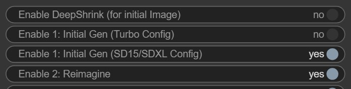
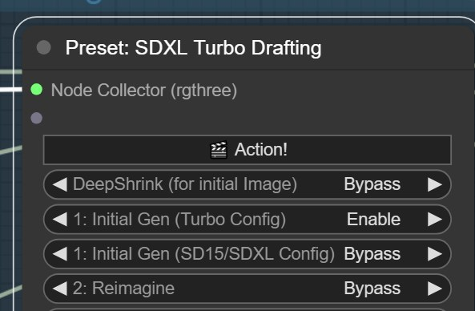

# Truly Modular Workflows

**_Rethinking the way we use ComfyUI_**

## Main features:
> Breaks up the workflow into functional parts called modules.

Several powerful modules are included for you to play with. These are described in detail below and include:
- Combine and switch effortlessly between SDXLTurbo, SD15 and SDXL, IPAdapter with Masking, HiresFix, Reimagine, Variation Maker, Noise Detailer, Person Detailer, Latent Upscale, Ultimate SDUpscale, IPAdapter assisted Upscale, Face Detailer, Face Swap, Controlnet Pose/Depth (single and batch), LCM Sampling for any module, IPAdapter for any module, Background Swapping, Auto generation (One Button Prompt), SDXLTurbo Live Drafting, Execution Presets, Image Choosers, Passing Loras and Embeddings directly through your prompt and more.

Easily extend the workflow with your own plug-and-play modules. More information below.

> Easily Toggle any module of the workflow on or off.

Use a single UI Switch to toggle any of the modules, creating your own custom workflow with just a few clicks.

ℹ️ <i>Example</i>

> Create Execution Presets
- Configure which modules you want to run in your workflow and save them as a preset that can be run with a single click.

ℹ️ <i>Example</i>

## The Modules

## Installation