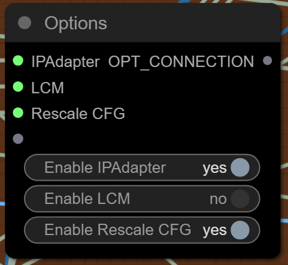
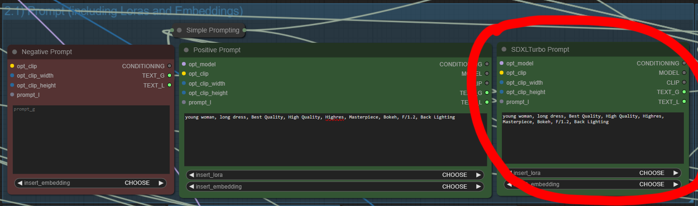
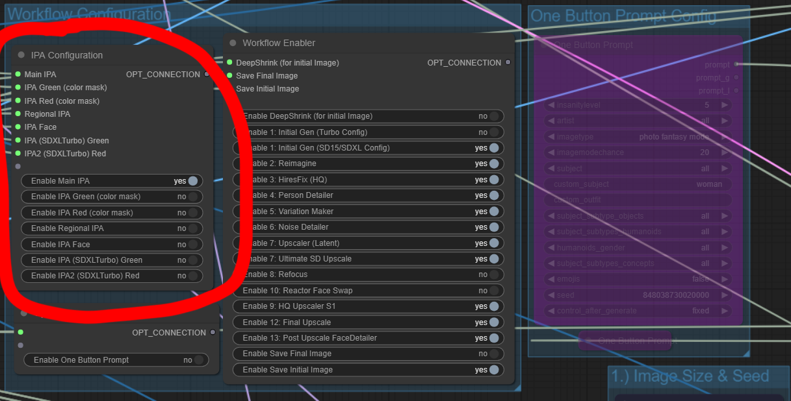
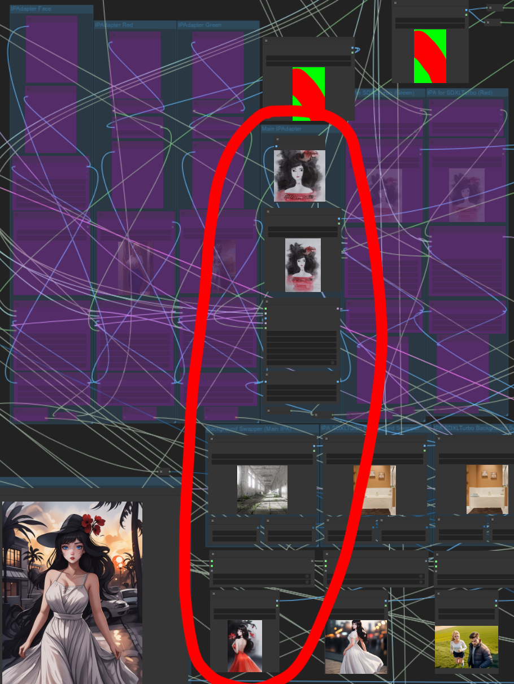

# Truly Modular Workflows

**_Rethinking the way we use ComfyUI_**

A [ComfyUI](https://github.com/comfyanonymous/ComfyUI) workflow that uses the latest and greatest community nodes in innovative ways to achieve complete control over the execution.

## Main features:
### Breaks up the workflow into functional parts called modules (or stages).

> Several powerful modules are included for you to play with. These are described in detail below and include:
> - Combine and switch effortlessly between SDXLTurbo, SD15 and SDXL, IPAdapter with Masking, HiresFix, Reimagine, Variation Maker, Noise Detailer, Person Detailer, Latent Upscale, Ultimate SDUpscale, IPAdapter assisted Upscale, Face Detailer, Face Swap, Controlnet Pose/Depth (single and batch), LCM Sampling for any module, IPAdapter for any module, Background Swapping, Auto generation (One Button Prompt), SDXLTurbo Live Drafting, Execution Presets, Image Choosers, Kohya DeepShrink, Passing Loras and Embeddings directly through your prompt and more.

> Easily extend the workflow with your own plug-and-play modules. More information below.

### Easy Toggles.

> Use a single UI Switch to toggle any of the modules, creating your own custom workflow with just a few clicks.
> 

> 
ℹ️ <i>Workflow Enabler</i>

> 
> 
> 
> 

### Create Presets.
> Configure which modules you want to run in your workflow and save them as a preset that can be run with a single click.
> 

> 
ℹ️ <i>Presets Window</i>

> 
> 
> 
> 

### Selective Processing.
> Generate several images and choose which ones you wish to progress.
> 

> 
ℹ️ <i>Image Chooser</i>

>
> 
>
> 

### Pause, Resume and Restart (Anywhere).
> Pause and restart the workflow at any stage or module of your choice with any images of your choice.
> 

> 
ℹ️ <i>Always Pause</i>

>
> Pauses the workflow before any particular module and lets you select which images (from the previous stage) to progress.
>
> 
>
> 

> 

> 
ℹ️ <i>Pause if Batch</i>

>
> Pauses the workflow before any particular module, but only if there is more than one incoming image (from the previous stage) to choose from.
>
> 
>
> 

> 

> 
ℹ️ <i>Pass through</i>

>
> Does not pause the workflow before the module and automatically passes on any incoming images (from the previous stage).
>
> 
>
> 

>
> Watch the video, which shows how to switch between modes, how to choose images and how to resume the workflow at a specific module:
>
> 
> 

### Instantly switch between SDXL, SD15 and SDXLTurbo.
> Switch between SDXL, SD15 and SDXLTurbo with the click of a button. This uses special repeater nodes to automatically switch all modules to the proper CLIP format and to activate the correct IPAdapter models as well as the correct controlnet models. The only thing you may have to do is update your custom loras.
> 
> You can also start progressing an image in SDXL and pause the workflow anywhere you like, switch to SD15 and continue form there.
> 
> Prop tip: Start by generating a large batch of images in SDXLTurbo or even in Live Drafting. Then select the images you like and continue processing them with a high quality model in SD1.5. Simply activate 'Initial Gen (Turbo)' in the Workflow Enabler and activate 'Enable SD1.5' in the SD1.5 or SDXL selection Box. Your initial image will be generated using SDXLTurbo and the rest will be done in SD1.5. Of course you may also configure any particular custom models and VAE you'd like to use. It's that easy.
> 

> 
ℹ️ <i>Example</i>

>
> 
> 
> > 
>
> 

### Powerful Control Panels.
> Each module comes with a separate control panel that allows configuration of all parameters.
> 

> 
ℹ️ <i>Example</i>

>
> 
>
> 

>
> The control panel includes an Options box that allows you to toggle the use of LCM, IPAdapter and CFG Rescale within that module.
> 

> 
ℹ️ <i>Options Example</i>

>
> 
>
> 

>
> You have fine control over the start, end and strength of the IPAdapter in each module. Or you can disable the use of IPAdapter altogether. You may even pass a completely new image to the IPAdapter. On top of that you may mix the new image with the original image (from the previous stage) and define the strength of each one (dual IPAdapter).
> 

> 
ℹ️ <i>IPA Example</i>

>
> 
>
> 

>
> For each module you may configure any sampler and scheduler you prefer, as well as cfg and steps. The options panel allows you to switch to the LCM sampler in order to speed up the processing time of the module significantly. Simply activate 'Enable LCM' and set the KSampler Config  in the modules control panel. Select the 'LCM' sampler and 'sgm_uniform' scheduler, steps 4 and cfg 1.1. That's it. Your module is now using high-speed LCM sampling. This works for all modules, latent upscalers, detailers, highres fix, sdupscale and so on.
> 

> 
ℹ️ <i>LCM Example</i>

>
> 
>
> 

> 
> Some modules contain additional parameters and toggles which are specific to the module. The detailers include additional prompts, upscalers include resize options etc.

### Powerful Prompting.
> The main control panel provides a powerful prompting experience which includes:
> 
> 

> 
ℹ️ <i>Activating and loading Loras and Embeddings directly in the prompt</i>

> No need to configure Lora panels. Simply select your Lora in the prompt and it will be loaded automatically. The same goes for embeddings.
>
> 
>
> 

>  
>
> 

> 
ℹ️ <i>Prompt Styles</i>

>
> Quickly and easily apply additional styles to your prompt by selecting from a list. You may also add your own styles. 
>
> 
>
> 

>  
>
> 

> 
ℹ️ <i>Prompt Builder</i>

>
> Use the prompt builder provided by the amazing [Lt. Data's Inspire Pack](https://github.com/ltdrdata/ComfyUI-Inspire-Pack) node to help you build the perfect prompt or come up with new ideas. 
>
> 
>
> 

>  
>
> 

> 
ℹ️ <i>Auto-Generated Prompts</i>

>
> Activate the 'One button prompt' in the workflow enabler and it will automatically generate prompts for you. 
>
> You may configure the subjects, concepts and the amount of randomness to your liking.
> 
> > 
> 
> Pro tip: Enable SDXLTurbo and activate the 'One button prompt'. Use the 'SDXLTurbo Drafting Preset' or setup the workflow to only generate an initial image by deactivating all modules, except for 'Initial Image SDXL Turbo'. Configure a batch size of 4 or more images. Set the Initial Image Preview Window to 'pass through', so the workflow does not pause. Also enable 'save initial image' in the workflow enabler. Set ComfyUI to 'Auto Queue' via the Extra Options checkbox. Your workflow will now auto-generate images using SDXLTurbo and the One-Button-Prompt. It will save the generated images (by default) to your output/Draft directory. You can then go through the images and choose the ones that have potential to process them further. Simply drag and drop the image to your ComfyUI window and reconfigure the workflow enabler to generate variations, detailing, upscaling and so on.   
>
> 
>
> 

>  
>
> 

> 
ℹ️ <i>Separate SDXLTurbo Prompt</i>

>
> A separate Prompt box for SDXLTurbo is provided and sits right next to the main prompt. This way you can have two prompts, one for your main SD1.5 and SDXL prompting and one for your initial image generation with SDXLTurbo. The SDXLTurbo prompt always uses SDXL CLIP, even if you use a SD1.5 model as your primary model and prompt. You may use SDXL loras in the prompt as normal, even if your main model is SD1.5. The workflow handles this automatically. There is no negative prompt for SDXLTurbo because SDXLTurbo runs on cfg 1 and doesn't use it.
>
> 
>
> 

### Powerful Controlnets.
> You can easily switch on and off controlnets from the controlnet panel which sits right above the prompting panel.
> 

> 
ℹ️ <i>Controlnet Panel</i>

>
> 
>
> 

>
> There are three different ways of loading controlnet images:
> * Direct (a single image that contains the pose or depth information directly), 
> * Dir (loading images from a directory for batch processing) and 
> * Image (by supplying a single 'normal' image - the workflow will obtain the pose or depth from it).
>
> You may activate one of these modes for both depth and pose in the controlnet panel. The corresponding upload window in the controlnet configuration (to the right of the controlnet panel) will be enabled. Here you can upload your image or, in the case of batch processing (dir mode), supply a directory path to your images.
> 

> 
ℹ️ <i>Controlnet Configuration</i>

>
> 
>
> 

>
> Watch the video, which shows how to use direct pose and batch pose functionality:
> 
> 

### Powerful IPAdapters.
>  [Matt3o's ComfyUI IPAdapter Plus](https://github.com/cubiq/ComfyUI_IPAdapter_plus/tree/main) is one of the most amazing things to happen to SD and this workflow makes heavy use of it. Included are seven different IP Adapters that you can make use of. Each of them may be enabled or disabled directly through the IPA Options Panel.
> 

> 
ℹ️ <i>The IPA Options Panel</i>

>
> Choose which IPAdapters you want to activate. More information about each of the adapters is provided below.
>
> 
>
> 

>  
> 

> 
ℹ️ <i>Main IPA</i>

>
> Activating the Main IPA will enable the center column of the IPA Configuration. Here you may configure all aspects of the main IPAdapter. By default the main IPA affects the entire image and does not use any masking. However, in the lower part of the configuration area you may swap out the background of your IPAdapter Image.
>
> 
> 

>  
> 

> 
ℹ️ <i>About Background Swaps</i>

>
> Among other things, background swapping on the IPA Image allows us to place our subject in totally new environments. You may also place your subject in different areas of the 256x256 Clip Vision Image by manipulating the X and Y Offsets next to the background image upload window. The Clip Vision Preview will update on generation and show you where your subject will appear in relation to the background.
>
> Below we see the image produced by our default IPA Image without any background swapping:
>
> 
>
> Below we see the image produced by providing a background image and activating the swap background function:
>
> 
>
> Background Swapping is available for the Main IPA and for the SDXLTurbo Green and Red IPAs.
> 
> 

>  
> 

> 
ℹ️ <i>About Subject Focus</i>

>
> Another useful technique supported by the workflow, is subject focus. Here we upload an image that contains our subject in some composition, pose or setting. This image should have the same size as our initial generation (e.g. 512x768). The subject is then detected on that image and automatically masked. This mask is then applied to the IPAdapter. As a result the IPAdapter is only applied to our subject and not to the background.
>
> Below we see the image produced by background swapping + subject focus. Note that due to our use of subject focus the background swap has almost no effect as the IPAdapter is focusing on the subject only, leaving the rest to our prompt and model.
>
> 
>
> 

## The Modules

## Installation