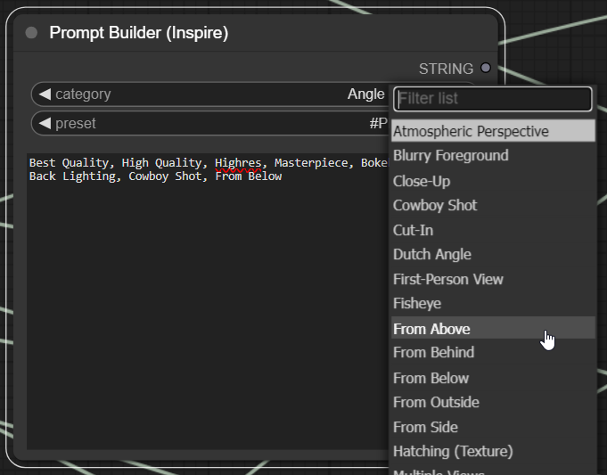

# Truly Modular Workflows

**_Rethinking the way we use ComfyUI_**

A feature rich [ComfyUI](https://github.com/comfyanonymous/ComfyUI) workflow that uses the latest and greatest community nodes ([Rgthree Nodes](https://github.com/rgthree/rgthree-comfy), [IPAdapter Plus](https://github.com/cubiq/ComfyUI_IPAdapter_plus), [Impact Pack](https://github.com/ltdrdata/ComfyUI-Impact-Pack), [Image Picker](https://github.com/chrisgoringe/cg-image-picker) and others) in innovative ways to achieve complete control over the execution. Beyond that we provide a template, along with instructional videos, for the community to adapt and take the next step in creating truly modular workflows by passing contexts and images to modules, context switches and image choosers.

> [!IMPORTANT]  
> **Because the workflow now contains more than 1000 Nodes, you must apply the following change to your ComfyUI installation:**
> 1. Open ``ComfyUI/web/lib/litegraph.core.js``
> 2. Find the String ``MAX_NUMBER_OF_NODES: 1000`` and change it to ``MAX_NUMBER_OF_NODES: 5000``
> 3. Save the file and restart your ComfyUI. You are now able to load the workflow (and any other workflows with more than 1k nodes).

 

## Table of Contents
[Changelog](#notable-features)

[Features](#notable-features)

[Getting Started](#getting-started)

[Modules](#the-modules)

[Installation](#Installation)

[Designing your own modular workflows](#extending-or-designing-your-own-truly-modular-workflows)

[FAQ](#FAQ)

[Troubleshooting](#Troubleshooting)

## Changelog
## [0.9.1] - 2023-12-20
- Added Photoshop Live Inpainting. 
  - To use it, scroll to the very left of the workflow and enter the photoshop server password into the Photoshop to ComfyUI node. 
  - Watch the Tutorial here: https://www.youtube.com/watch?v=Eu1vLWHZkDs
- Added the ability to choose custom checkpoints for most modules
- Added the ability to replace or extend prompts for most modules
- Refactored all control panels to use the newly added ComfyUI Group nodes
- Refactored and added much improved upscaling modules
- Added a MaxQuality Preset
- Reworked the Reimagine module (it can do even more amazing things now, try it).
- Several other fixes and improvements
- Important: ``MAX_NUMBER_OF_NODES: 5000`` must be set in ``ComfyUI/web/lib/litegraph.core.js``

## Notable Features
### Breaks up the workflow into functional parts called modules (or stages).

> Several powerful modules are included for you to play with. These are described in detail below and include:
> - Combine and switch effortlessly between SDXLTurbo, SD15 and SDXL, IPAdapter with Masking, HiresFix, Reimagine, Variation Maker, Noise Detailer, Person Detailer, Latent Upscale, Ultimate SDUpscale, IPAdapter assisted Upscale, Face Detailer, Face Swap, Controlnet Pose/Depth (single and batch), LCM Sampling for any module, IPAdapter for any module, Background Swapping, Auto generation (One Button Prompt), SDXLTurbo Live Drafting, Execution Presets, Image Choosers, Kohya DeepShrink, Passing Loras and Embeddings directly through your prompt and more.

> Easily extend the workflow with your own plug-and-play modules. More information below.

### Easy Toggles.

> Use a single UI Switch to toggle any of the modules, creating your own custom workflow with just a few clicks.
> 

> 
ℹ️ <i>Workflow Enabler</i>

> 
> 
> 
> 

### Create Presets.
> Configure which modules you want to run in your workflow and save them as a preset that can be run with a single click.
> 

> 
ℹ️ <i>Presets Window</i>

> 
> 
> 
> 

### Selective Processing.
> Generate several images and choose which ones you wish to progress.
> 

> 
ℹ️ <i>Image Chooser</i>

>
> 
>
> 

### Pause, Resume and Restart (Anywhere).
> Pause and restart the workflow at any stage or module of your choice with any images of your choice.
> 

> 
ℹ️ <i>Always Pause</i>

>
> Pauses the workflow before any particular module and lets you select which images (from the previous stage) to progress.
>
> 
>
> 

> 

> 
ℹ️ <i>Pause if Batch</i>

>
> Pauses the workflow before any particular module, but only if there is more than one incoming image (from the previous stage) to choose from.
>
> 
>
> 

> 

> 
ℹ️ <i>Pass through</i>

>
> Does not pause the workflow before the module and automatically passes on any incoming images (from the previous stage).
>
> 
>
> 

>
> Watch the video, which shows how to switch between modes, how to choose images and how to resume the workflow at a specific module:
>
> 
> 

### Instantly switch between SDXL, SD15 and SDXLTurbo.
> Switch between SDXL, SD15 and SDXLTurbo with the click of a button. This uses special repeater nodes to automatically switch all modules to the proper CLIP format and to activate the correct IPAdapter models as well as the correct controlnet models. The only thing you may have to do is update your custom loras.
> 
> You can also start progressing an image in SDXL and pause the workflow anywhere you like, switch to SD15 and continue form there.
> 
> Prop tip: Start by generating a large batch of images in SDXLTurbo or even in Live Drafting. Then select the images you like and continue processing them with a high quality model in SD1.5. Simply activate 'Initial Gen (Turbo)' in the Workflow Enabler and activate 'Enable SD1.5' in the SD1.5 or SDXL selection Box. Your initial image will be generated using SDXLTurbo and the rest will be done in SD1.5. Of course you may also configure any particular custom models and VAE you'd like to use. It's that easy.
> 

> 
ℹ️ <i>Example</i>

>
> 
> 
> > 
>
> 

### Powerful Control Panels.
> Each module comes with a separate control panel that allows configuration of all parameters.
> 

> 
ℹ️ <i>Example</i>

>
> 
>
> 

>
> The control panel includes an Options box that allows you to toggle the use of LCM, IPAdapter and CFG Rescale within that module.
> 

> 
ℹ️ <i>Options Example</i>

>
> 
>
> 

>
> You have fine control over the start, end and strength of the IPAdapter in each module. Or you can disable the use of IPAdapter altogether. You may even pass a completely new image to the IPAdapter. On top of that you may mix the new image with the original image (from the previous stage) and define the strength of each one (dual IPAdapter).
> 

> 
ℹ️ <i>IPA Example</i>

>
> 
>
> 

>
> For each module you may configure any sampler and scheduler you prefer, as well as cfg and steps. The options panel allows you to switch to the LCM sampler in order to speed up the processing time of the module significantly. Simply activate 'Enable LCM' and set the KSampler Config  in the modules control panel. Select the 'LCM' sampler and 'sgm_uniform' scheduler, steps 4 and cfg 1.1. That's it. Your module is now using high-speed LCM sampling. This works for all modules, latent upscalers, detailers, highres fix, sdupscale and so on.
> 

> 
ℹ️ <i>LCM Example</i>

>
> 
>
> 

> 
> Some modules contain additional parameters and toggles which are specific to the module. The detailers include additional prompts, upscalers include resize options etc.

### Powerful Prompting.
> The main control panel provides a powerful prompting experience which includes:
> 
> 

> 
ℹ️ <i>Activating and loading Loras and Embeddings directly in the prompt</i>

> No need to configure Lora panels. Simply select your Lora in the prompt and it will be loaded automatically. The same goes for embeddings.
>
> 
>
> 

>  
>
> 

> 
ℹ️ <i>Prompt Styles</i>

>
> Quickly and easily apply additional styles to your prompt by selecting from a list. You may also add your own styles. 
>
> 
>
> 

>  
>
> 

> 
ℹ️ <i>Prompt Builder</i>

>
> Use the prompt builder provided by the amazing [Lt. Data's Inspire Pack](https://github.com/ltdrdata/ComfyUI-Inspire-Pack) node to help you build the perfect prompt or come up with new ideas. 
>
> 
>
> 

>  
>
> 

> 
ℹ️ <i>Auto-Generated Prompts</i>

>
> Activate the 'One button prompt' in the workflow enabler and it will automatically generate prompts for you. 
>
> You may configure the subjects, concepts and the amount of randomness to your liking.
> 
> > 
> 
> Pro tip: Enable SDXLTurbo and activate the 'One button prompt'. Use the 'SDXLTurbo Drafting Preset' or setup the workflow to only generate an initial image by deactivating all modules, except for 'Initial Image SDXL Turbo'. Configure a batch size of 4 or more images. Set the Initial Image Preview Window to 'pass through', so the workflow does not pause. Also enable 'save initial image' in the workflow enabler. Set ComfyUI to 'Auto Queue' via the Extra Options checkbox. Your workflow will now auto-generate images using SDXLTurbo and the One-Button-Prompt. It will save the generated images (by default) to your output/Draft directory. You can then go through the images and choose the ones that have potential to process them further. Simply drag and drop the image to your ComfyUI window and reconfigure the workflow enabler to generate variations, detailing, upscaling and so on.   
>
> 
>
> 

>  
>
> 

> 
ℹ️ <i>Separate SDXLTurbo Prompt</i>

>
> A separate Prompt box for SDXLTurbo is provided and sits right next to the main prompt. This way you can have two prompts, one for your main SD1.5 and SDXL prompting and one for your initial image generation with SDXLTurbo. The SDXLTurbo prompt always uses SDXL CLIP, even if you use a SD1.5 model as your primary model and prompt. You may use SDXL loras in the prompt as normal, even if your main model is SD1.5. The workflow handles this automatically. There is no negative prompt for SDXLTurbo because SDXLTurbo runs on cfg 1 and doesn't use it.
>
> 
>
> 

### Powerful Controlnets.
> You can easily switch on and off controlnets from the controlnet panel which sits right above the prompting panel.
> 

> 
ℹ️ <i>Controlnet Panel</i>

>
> 
>
> 

>
> There are three different ways of loading controlnet images:
> * Direct (a single image that contains the pose or depth information directly), 
> * Dir (loading images from a directory for batch processing) and 
> * Image (by supplying a single 'normal' image - the workflow will obtain the pose or depth from it).
>
> You may activate one of these modes for both depth and pose in the controlnet panel. The corresponding upload window in the controlnet configuration (to the right of the controlnet panel) will be enabled. Here you can upload your image or, in the case of batch processing (dir mode), supply a directory path to your images.
> 

> 
ℹ️ <i>Controlnet Configuration</i>

>
> 
>
> 

>
> Watch the video, which shows how to use direct pose and batch pose functionality:
> 
> 

### Powerful IPAdapters.
>  [Matt3o's ComfyUI IPAdapter Plus](https://github.com/cubiq/ComfyUI_IPAdapter_plus/tree/main) is one of the most amazing things to happen to SD and this workflow makes heavy use of it. Included are seven different IP Adapters that you can make use of. Each of them may be enabled or disabled directly through the IPA Options Panel.
> 

> 
ℹ️ <i>The IPA Options Panel</i>

>
> Choose which IPAdapters you want to activate. More information about each of the adapters is provided below.
>
> 
>
> 

>  
> 

> 
ℹ️ <i>Main IPA</i>

>
> Activating the Main IPA will enable the center column of the IPA Configuration. Here you may configure all aspects of the main IPAdapter. By default the main IPA affects the entire image and does not use any masking. However, in the lower part of the configuration area you may swap out the background of your IPAdapter Image.
>
> 
> 

>  
> 

> 
ℹ️ <i>About Background Swaps</i>

>
> Among other things, background swapping on the IPA Image allows us to place our subject in totally new environments. You may also place your subject in different areas of the 256x256 Clip Vision Image by manipulating the X and Y Offsets next to the background image upload window. The Clip Vision Preview will update on generation and show you where your subject will appear in relation to the background.
>
> Below we see the image produced by our default IPA Image without any background swapping:
>
> 
>
> Below we see the image produced by providing a background image and activating the swap background function:
>
> 
>
> Background Swapping is available for the Main IPA and for the SDXLTurbo Green and Red IPAs.
> 
> 

>  
> 

> 
ℹ️ <i>About Subject Focus</i>

>
> Another useful technique supported by the workflow, is subject focus. Here we upload an image that contains our subject in some composition, pose or setting. This image should have the same size as our initial generation (e.g. 512x768). The subject is then detected on that image and automatically masked. This mask is then applied to the IPAdapter. As a result the IPAdapter is only applied to our subject and not to the background.
>
> Below we see the image produced by background swapping + subject focus. Note that due to our use of subject focus, the background swap has almost no effect because the IPAdapter is focusing on the subject only, leaving the rest to our prompt and model.
>
> 
>
> 

>  
> 

> 
ℹ️ <i>IPAdapter Red and Green</i>

>
> The workflow supports IPAdapter attention masking. To do this, we activate the red and/or green IPAdapters and provide a color mask to the load image node situated above the reg/green IPAdapter control panel. I highly recommend you try out [Lt. Data's Workflow Component](https://github.com/ltdrdata/ComfyUI-Workflow-Component) to easily draw and modify red/green masks on the fly without leaving ComfyUI. This way you can render an image, copy the clip space to the attention mask node and modify it into a red/green mask using the Image Refiner. To use the Image Refiner simply right click on the load image node and select it from the menu. 
> 
> The IPAdapter red will be applied to the red portion of the mask. The IPAdapter green will be applied to the green portion of the mask. It is possible to draw inbetween colors (e.g. yellow) to mix the application. 
> 
> In the example below, we create a very rough and simple reg/green mask and upload it to the attention mask node situated above the IPA red/green configuration panels. We then upload an Image of our hand drawn subject to the IPAdapter red. To the IPAdapter green we upload a moody image of a window with light coming through. The IPAdapters apply the concepts according to our mask as can be seen in the result image.
>
> 
>
> 

>  
> 

> 
ℹ️ <i>IPAdapter (SDXLTurbo) Red and Green</i>

>
> These IPAdapters are only applied when activated in the control panel and when using SDXLTurbo. They are mainly provided because you might wish to use SD1.5 and SDXLTurbo together but with different IPAdapters for each. Their functionality is exactly the same as described in the prior sections above. You can use Background Swapping, Subject Focus and Attention Masking. Please refer to the sections above for detailed information.
>
> > 
> 
> 

>  
> 

> 
ℹ️ <i>Regional IPAdapter</i>

>
> On the IPA control panel we may enable the regional IPAdapter. The regional IPAdapter takes a RGB color mask and three input images, one for each color. The concept of each image will be applied according to the RGB color mask, which should have the same dimensions as the generated image (e.g. 768x512 in the example below). Again, it can be useful to try the Image Refiner in order to draw the mask easily. But you may also do this in any other program of course. The regional IPAdapter does not function when using SDXLTurbo (but it will apply on subsequent modules such as HighResFix etc., as these are done with SD1.5. or SDXL). When using SDXLTurbo, refer to the SDXLTurbo Red/Green IPAdapters.
>
> > 

> > 
ℹ️ <i>Regional IPAdapter Overview</i>

> >
> > 
> >
> > 

> >  
> > 

> > 
ℹ️ <i>Regional IPAdapter Usage</i>

> >
> > 
> >
> > 

>
> 

>  
> 

> 
ℹ️ <i>Face IPAdapter</i>

>
> The face IPAdapter is supplied with two images, the subjects face we wish to target and a second image that contains our general composition (e.g. by simply generating an initial image). The face is then detected in the composition and an attention mask is created. The target face is then applied via the IPAdapter Plus Face model. The correct face model (SDXL or SD15) is supplied automatically. 
> 
> Therefore, we are now able to produce the target face on initial generation without using any detailers.
> 
> The concept and usage is shown in the image below.
>
> > 
>
> 

>  
## Getting Started
> 

> 
ℹ️ <i>Workflow Overview</i>

>
> The workflow is divided into **two** areas, the **user area** and the module and workflow **implementation** area.
> During usage it is usually enough to stay in the user controls area. The image below illustrates the concept.
>
> 
> 

>  
> 

> 
ℹ️ <i>Workflow Detail View</i>

>
> The workflow consists of many modules that are grouped in module clusters (1 to 4).
> 
> The user area consists of the module control panels, the initial image chooser, the final image, the workflow enabler, the prompting area, the model configuration area, the controlnet area, the IPAdapter area and the presets.
> 
> The image below illustrated the above concepts and shows the locations of the mentioned parts.
>
> 
> 

>  
> 

> 
ℹ️ <i>Workflow Usage</i>

>
> During usage the following flow (within the user area) is suggested:
> 
> 
> 
> 1) Start with the workflow enabler. Enable one of the **Initial Gen Modules**, either **SDXLTurbo** or **SD15/SDXL**. If you enable both, then SDXLTurbo will be used to generate the initial image. It does not make sense to enable both, so choose one.
>
> 
>2) Continue along the flow to the **prompting** area. This area also contains controls for the **image size**, **batch** and **seed**, so set them now as needed. The workflow completely supports batch generation in all modules. In fact the workflow shines when using at least a batch size of four to narrow down to the good images via the preview choosers.
> 
> 
> 3) Next is the prompt, if you enabled SDXLTurbo, you need to type your prompt into the **(smaller) SDXLTurbo box**. Otherwise if you are using SD15/SDXL, type your prompt into the **big green positive prompt box**. You may also **add loras and embeddings** as needed via the prompt box (choose them from the insert_lora and insert_embedding controls). A bit to the right is the Prompt Styles area, where you can configure additional styles for your prompt. The one-button prompt is an exception and sits next to the workflow enabler. So if you want to use that, go back to the workflow enabler. 
> 
> 
> 4) Continue along the flow. Below the prompting area is the **model configuration area**. Here you should setup your SDXLTurbo model, your SD15 model and your SDXL model, along with any VAEs. The VAEs are optional, if you have a baked VAE in your model, then simply bypass them (CTRL+B). Be sure to configure the **SDXL or SD15? box**. Here you decide which model will be used to generate your images. You can switch between SDXL and SD15 seemlessly and at any time here.
> 
>
> 5) Now pass below the Initial Image Preview Chooser (big black box in the middle) and configure the sampler, steps, cfg and scheduler for the generation of the initial image. You may also activate LCM here. If you use SDXLTurbo, the SDXLTurbo configuration (just a bit to the right) will be used instead.  
>
> 
> 6) Optionally: Now is the time to configure and enable any optional IPAdapters and Controlnets you might want to use. The IPAdapters can be enabled next to the workflow enabler and they are configured just to the left of it. The controlnets are to the right of the workflow enabler, they can be enabled above the prompt panel and source images are provided in the area to the right of the prompt panel. These areas are also marked on the overview images. There is a lot you can and play around with here, so be sure to get into it after generating your first images.
> 
> 
> 7) You can now queue your first generation. If you configured your models properly your first images should appear in the Initial Image Preview Chooser (big black box in the middle). **It is highly likely that you will get some errors when you first install and try the workflow. It's a huge workflow and there are several model loaders where you need to supply a detector model, an IPAdapter and clip vision model, an LCM Lora, controlnet models and so on. Your filepaths and filenames to those models are different from mine, so you'll have to set them up properly. You may also have to supply images to some of the Load Image nodes. You only have to do this once and as soon as all the model loaders are satisfied there should not be any errors.**
>
> 
> 8) Choose one (or several) of the images from the Initial Image Preview Chooser box. This is done by clicking on the images you want (which highlights them with a green border) and then on the button **progress selected image as restart**. Note: If you want to choose your images, the Image Chooser must be set to **Always Pause** or at least to **Pause on Batch**. If the image chooser is set to **pass through**, the workflow will not pause and you will not be able to choose images until the workflow is finished. However, once the workflow is finished you may still choose images from any of the image choosers and **restart the flow** from there. Setting the image choosers to **pass through** is useful when you are confident that you don't need to interfere at that module or step.
>
> 9) Continue along the flow, now passing into the first module control box, the **Reimagine module**. Note: You will only pass into this module if you enable it in the **Workflow Enabler**. I suggest you do so now because it's a pretty fun module to play around with. All module control boxes have an **Image Chooser Input** to the right and a **Result Preview** (light grey box) to the left of that. You can change the module configuration and restart the workflow from the **Image Chooser Input**. This way you can iterate on your image, optimizing the settings and getting fast feedback by restarting only the module you are currently working on. You don't even need to leave the module controlbox usually.
> 
> 
> 10) To be continued... explore on your own for now.
> 

## The Modules
TODO. For now refer to [Features](#notable-features) and [Getting Started](#getting-started).

## Extending or Designing your own truly modular workflows
There are probably many ways of doing this. I will show you my way. It is how I built this workflow and I recommend you stick to this architecture if you'd like to extend it. 

This section will be more detailed in the future, for now I made a quick [Youtube video](https://youtu.be/CMrnVpWvFNQ) that shows the concepts of using **contexts**, **context switches** and **image choosers** to build **optional modules** of pretty much anything, generators for LCM/SD15/SDXL/SDXLTurbo, upscalers, ipadapters, you name it.

You will require at least the following modules to follow along:
[Rgthree Nodes](https://github.com/rgthree/rgthree-comfy), [IPAdapter Plus](https://github.com/cubiq/ComfyUI_IPAdapter_plus), [Image Picker](https://github.com/chrisgoringe/cg-image-picker). 
The IPAdapter is not really needed to understand and follow the concept, but I use it for fun and you should get it anyway.

## Installation

> [!IMPORTANT]  
> **Because the workflow now contains more than 1000 Nodes, you must apply the following change to your ComfyUI installation:**
> 1. Open ``ComfyUI/web/lib/litegraph.core.js``
> 2. Find the String ``MAX_NUMBER_OF_NODES: 1000`` and change it to ``MAX_NUMBER_OF_NODES: 5000``
> 3. Save the file and restart your ComfyUI. You are now able to load the workflow (and any other workflows with more than 1k nodes).

Simply load the json file in your ComfyUI. Make sure you have installed the **requirements** below and downloaded the needed **models**. 

**Important:** When you first load the workflow you need to select the correct models for IPAdapters (both SDXL and SD15), SDXL, SD15, SDXLTurbo, Ultralytics Detector, Upscaler Models, LCM Loras (because there is only one combobox for this one, which is marked on the Workflow Overview Image, you need to change it depending on SD15 and SDXL). You may also have to supply images to some of the Load Image nodes.

You will also need:
- an up to date [ComfyUI](https://github.com/comfyanonymous/ComfyUI) (run update_comfyui.bat inside your ComfyUI/update folder)
- an SD15 model (e.g. https://civitai.com/models/84728/photon)
- an SDXL model (e.g. https://civitai.com/models/122822/crystal-clear-xl)
- an SDXLTurbo model (e.g. https://civitai.com/models/84040/sdxl-turbo-unstable-diffusers-yamermix)
- an upscaler model (e.g. https://openmodeldb.info/models/4x-Swift-SRGAN)
- LCM Loras (for both SDXL and SD15)
  - https://huggingface.co/latent-consistency/lcm-lora-sdxl/tree/main
  - https://huggingface.co/latent-consistency/lcm-lora-sdv1-5/tree/main
- ultralytics detection models (yolovn etc.; these should download automatically during usage)
- ... perhaps something more? Let me know if I missed something.

Unless stated otherwise, download the below requirements by doing a ``git clone https://github.com/xxxx.git`` inside of your custom_modules folder.

**Requirements**:
- https://github.com/ltdrdata/ComfyUI-Manager.git
- https://github.com/rgthree/rgthree-comfy.git
- https://github.com/cubiq/ComfyUI_IPAdapter_plus.git

- Download models to ComfyUI/models/ipadapter/:
  - https://huggingface.co/h94/IP-Adapter/resolve/main/models/ip-adapter_sd15.bin
  - https://huggingface.co/h94/IP-Adapter/resolve/main/models/ip-adapter-plus_sd15.bin
  - https://huggingface.co/h94/IP-Adapter/resolve/main/models/ip-adapter-plus-face_sd15.bin
  - https://huggingface.co/h94/IP-Adapter/resolve/main/sdxl_models/ip-adapter_sdxl_vit-h.bin
  - https://huggingface.co/h94/IP-Adapter/resolve/main/sdxl_models/ip-adapter-plus_sdxl_vit-h.bin
  - https://huggingface.co/h94/IP-Adapter/resolve/main/sdxl_models/ip-adapter-plus-face_sdxl_vit-h.bin
- Download Clip Vision Encoder to ComfyUI/models/clip_vision/:
  - https://huggingface.co/h94/IP-Adapter/resolve/main/models/image_encoder/model.safetensors
- https://github.com/M1kep/ComfyLiterals.git
- https://github.com/ltdrdata/ComfyUI-Workflow-Component
- https://github.com/ltdrdata/ComfyUI-Impact-Pack.git
- https://github.com/ltdrdata/ComfyUI-Inspire-Pack.git
- https://github.com/WASasquatch/was-node-suite-comfyui
- https://github.com/BlenderNeko/ComfyUI_Noise.git
  - **[Bugfix]** Apply the following change to nodes.py: https://github.com/BlenderNeko/ComfyUI_Noise/pull/13/files
- https://github.com/AIrjen/OneButtonPrompt
- https://github.com/mav-rik/facerestore_cf.git
- https://github.com/Kosinkadink/ComfyUI-AnimateDiff-Evolved.git
- https://github.com/jags111/efficiency-nodes-comfyui.git
- https://github.com/Fannovel16/comfyui_controlnet_aux.git
- https://github.com/pythongosssss/ComfyUI-Custom-Scripts.git
- https://github.com/Suzie1/ComfyUI_Comfyroll_CustomNodes.git
- https://github.com/chrisgoringe/cg-image-picker.git
- https://github.com/wallish77/wlsh_nodes
- https://github.com/Kosinkadink/ComfyUI-VideoHelperSuite.git
- https://github.com/SeargeDP/SeargeSDXL.git
- https://github.com/shingo1228/ComfyUI-SDXL-EmptyLatentImage.git
- https://github.com/JPS-GER/ComfyUI_JPS-Nodes.git
- https://github.com/ssitu/ComfyUI_UltimateSDUpscale.git
- https://github.com/cubiq/ComfyUI_essentials.git
- https://github.com/omar92/ComfyUI-QualityOfLifeSuit_Omar92.git
- https://github.com/SeargeDP/SeargeSDXL.git
- https://github.com/twri/sdxl_prompt_styler.git
- Optional: Open a command line (cmd, terminal) in your main ComfyUI directory and run the following command to install rembg (when using WAS nodes this may not be required to do)
  - .\python_embeded\python.exe -m pip install rembg[gpu]

- https://github.com/Gourieff/comfyui-reactor-node.git
  - Attention: must run install.bat in custom_modules reactor directory.
  - Manual alternative for Python 3.11:
    - download insightface to comfyui root folder: https://github.com/Gourieff/Assets/raw/main/Insightface/insightface-0.7.3-cp311-cp311-win_amd64.whl
    - .\python_embeded\python.exe -m pip install -U pip 
    - .\python_embeded\python.exe -m pip install insightface-0.7.3-cp311-cp311-win_amd64.whl
  - Manual alternative for Python 3.10:
    - download insightface to comfyui root folder: https://github.com/Gourieff/Assets/raw/main/Insightface/insightface-0.7.3-cp310-cp310-win_amd64.whl
    - .\python_embeded\python.exe -m pip install -U pip
    - .\python_embeded\python.exe -m pip install insightface-0.7.3-cp310-cp310-win_amd64.whl

## FAQ
TODO. For now refer to [Getting Started](#getting-started).

## Troubleshooting
TODO. For now refer to [Getting Started](#getting-started) and [Installation](#Installation).

## Changelog
15/12/2023: initial Release Version 0.9